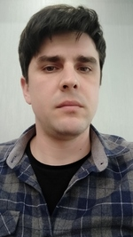

## Dimitriev Denis ##
#### Beginner front-end developer ####
***

## Contacts ##

* Moldova, Chisinau
* dimitriev.denis1988@gmail.com
* +37369057868
* [facebook](https://www.facebook.com/profile.php?id=100009932527900)
* [linkedin](https://www.linkedin.com/in/denis-dimitrev-4597751a3)

***
## Objective ##

The goal is to learn more deeply what front-end development is from real experts.
Understand how to properly use Javascript language tools
so that the future employer would notice my knowledge.

***
## Education ##
###### 1997-2006 ######
   * Romanian school nr.27 Chisinau
   
###### 2015-2016 ######
   * Accounting courses
   
###### 2019-present ######
   * IT courses at Institutul de Formare Continua
   
***

## Experience ##
###### 2013-2015 ######
*    Autoparts seller at SRL "OLGA-FURMANOV"

###### 2016-2017 ######
*    Accounting assistant at SRL "KURILOV-PLUS"

###### 2017-2019 ######
*    Sale manager at SRL [Catol-lux](http://https://catollux.md)

###### 2020-present ######
*    AnyKey at [Institutul de Formare Continua](http://www.iic.md)

###### 2020-present ######
*    AnyKey at [IT-STEP Academy](https://itstep.org)

***

## Skills ##
###### Software Knowledge ######
* Windows, 1C, and lot of standart office software

###### Level ######
  * I usually solve all problems what arises
  
###### Communicative ######
* I acquired this skill through my previous work in sales
  
###### Level ######
  * Depends on the environment and theme,
    not quite commercial, but good as a colleague
    
###### Languages ######
* Russian, Romanian, English
  
###### Level ######
  * First two strong, english A1, but I'm trying to figure it out
  
###### Programming Languages, Frameworks ######
* HTML, CSS, Boostrap, JavaScript, React
 
###### Level ######
  * Beginner 
  
***
 
## About me ##
At that time I was 32 years old.
I consider myself an adult enough guy to change profession, but as it is.
I am taking software engineering courses at a private educational institution, where, in principle, after
passing the first year exams with excellent marks, I received an invitation to work.
At the moment, there are no hobbies, except for everyday life and study, but I am not the only one, every
student experiences this.
I am optimistic about the future, I believe that I can get a position as a developer,
thereby improving my quality of life and meeting your daily needs.

###### About IT ######
Why did I choose THIS?
First, I loved computers for a very long time.
Until the age of 30, the goal was not to change profession, my environment changed and sooner or later you will
begin to acquire other people's habits.           